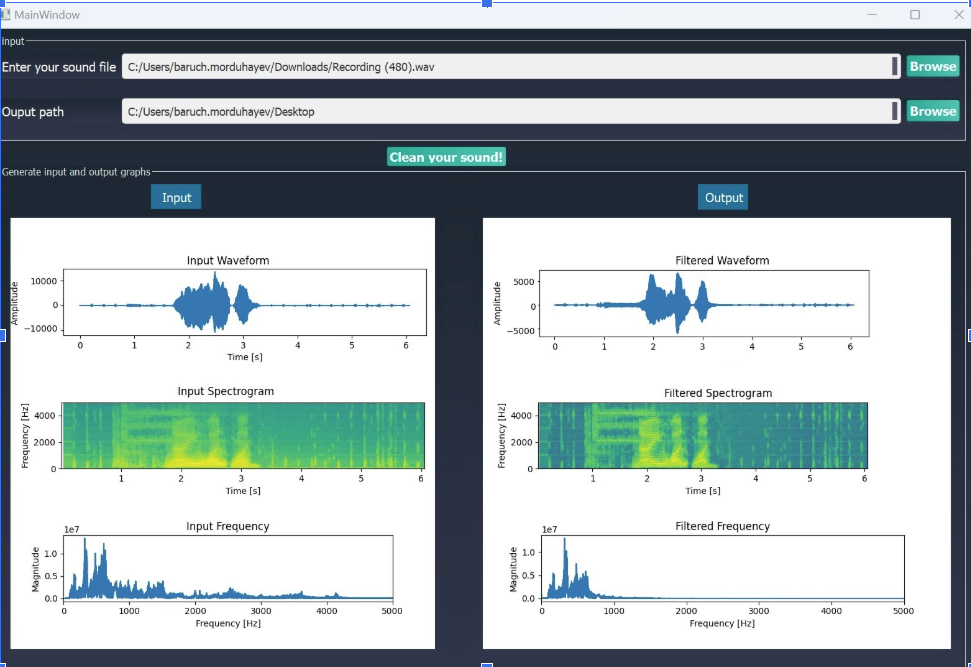
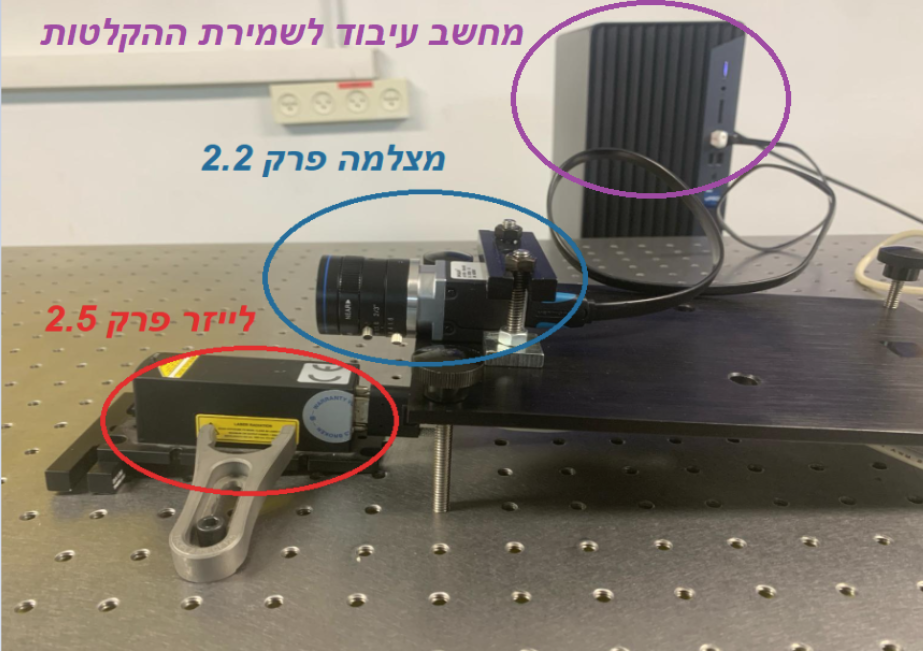

# Clean Sound with AI - Denoising Audio Using CNN

This project aims to clean sound recordings from noisy environments using a Convolutional Neural Network (CNN) based on the CleanUNet model. The application is built using Python and PyQt5 for the graphical user interface (GUI), and it employs the `torchaudio` library for audio processing.

## Abstract


Recording sound in a noisy environment poses many challenges when the desired audio signal (such as speech, music, or other sounds of interest) is masked or distorted by the presence of unwanted noise. This noise can come from various sources such as machinery, traffic, air conditioning systems, people talking, or other environmental sounds.
We built an optical microphone based on a green laser that picks up sound signals from the environment by continuously photographing the laser reflection from a talking person and performing a correlation between the images. We measured changes in the laser light and, using MATLAB, we converted it to audio signals. This technology offers several advantages over normal microphones. With the help of Artificial Intelligence, we built a filter to improve the sound of speech in a loud, noisy environment. The dynamic range of the optical microphone is usually extended up to 1 kHz due to imaging limitations.
In our project, the method involves self-collection of a database and using it with a developed algorithm to identify and improve the sound. Our final product is a GUI application that contains the learned deep learning model, which receives a noisy sound as input and returns the clean sound.

Setup:


## Table of Contents

- [Features](#features)
- [Installation](#installation)
- [Usage](#usage)
- [Project Structure](#project-structure)
- [How It Works](#how-its-works)
- [Dependencies](#dependencies)
- [Credits](#credits)
- [License](#license)

## Features

- **User-Friendly GUI**: Interact with the denoising process through an intuitive graphical interface.
- **Audio Denoising**: Clean noisy audio files using a trained CNN model.
- **Visualization**: Plot waveforms, spectrograms, and frequency spectra of the original and denoised audio.
- **File Management**: Easily select input files and output directories for processing.

## Installation

To run this project locally, follow these steps:

1. **Clone the repository:**

   ```bash
   git clone cd clean-sound-ai
   ```

2. **Install the required Python packages:**

   It's recommended to create a virtual environment first:

   ```bash
   python3 -m venv venv
   source venv/bin/activate  # On Windows, use `venv\Scripts\activate`
   ```

   Then, install the dependencies:

   ```bash
   pip install -r requirements.txt
   ```

3. **Download the CleanUNet model:**

   Place the `cleanunet_model_conc.pth` file in the root directory of the project. You can download it from [https://drive.google.com/file/d/13nAU00muAaqqnzb7WAk47JTWXrksOuip/view?usp=sharing](link-to-model-download).

## Usage

1. **Run the application:**

   ```bash
   python main.py
   ```

2. **Use the GUI:**

   - **Input File**: Click the "Browse" button to select a `.wav` file from your computer.
   - **Output Directory**: Click the "Browse" button to select a directory where the cleaned audio will be saved.
   - **Clean Audio**: Click the "Denoise" button to start the denoising process.
   - **Visualization**: The original and cleaned audio will be displayed in the waveform, spectrogram, and frequency spectrum plots.

## Project Structure

- `main.py`: Main script to run the GUI application.
- `clean_sound_gui.ui`: The UI file designed with Qt Designer.
- `CleanUNet/`: Directory containing the CleanUNet model implementation.
- `requirements.txt`: List of required Python packages.
- `SpyBot.qss`: Custom stylesheet for the PyQt5 GUI.
- `README.md`: This file.

## How It Works

1. **Model Loading**: The application loads the pre-trained CleanUNet model, which is designed to remove noise from audio signals.
2. **Audio Processing**: The noisy audio file is loaded, processed by the model, and the cleaned version is saved.
3. **Visualization**: The original and cleaned audio are visualized in the GUI using waveforms, spectrograms, and frequency spectra.

## Dependencies

- Python 3.8+
- PyQt5
- matplotlib
- numpy
- scipy
- librosa
- torchaudio
- torch

Install all dependencies via `pip` using the `requirements.txt` file provided.

## Credits

This project uses the [CleanUNet model] for audio denoising. The GUI is developed with PyQt5, and the audio processing leverages `torchaudio` and `librosa`.


